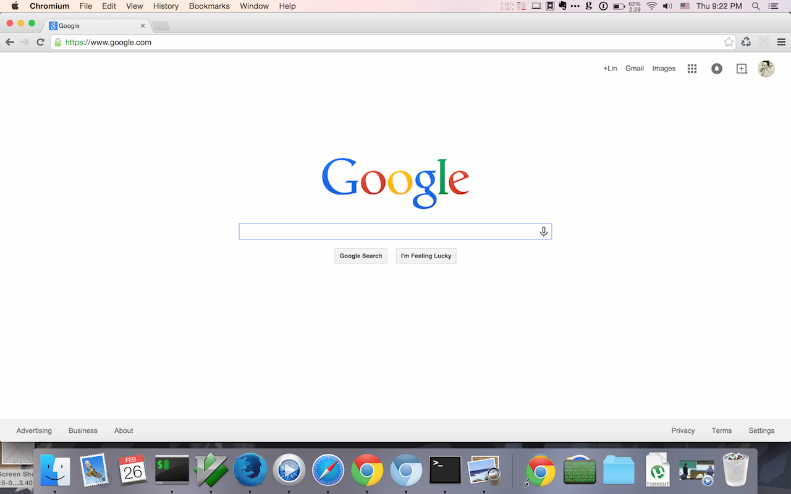
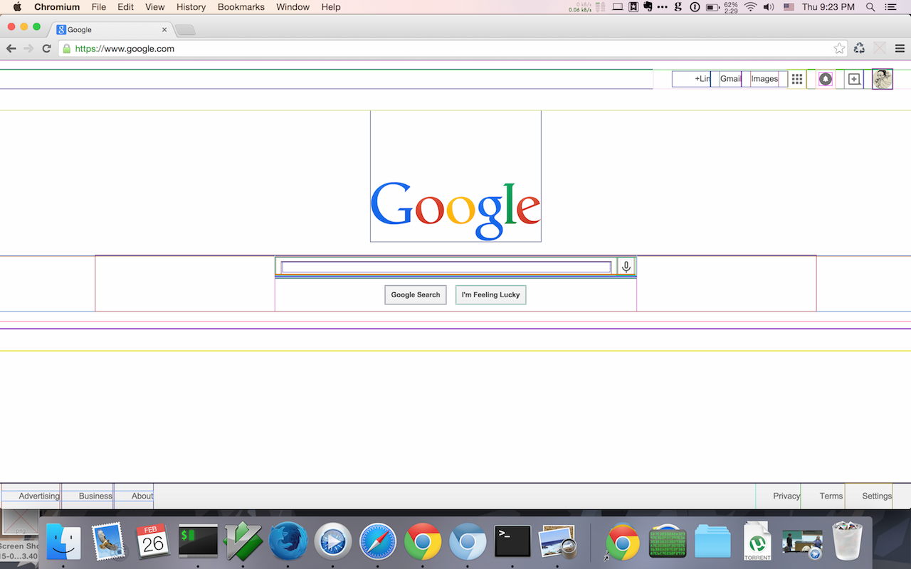

# Wireframe

Author: Lin Dong

Thu Feb 26 21:18:47 PST 2015

# Goal

[Wireframe]() will highlight the `div`s in the website to help developers to get a general idea about the website layout.

## Screenshot

Before

After

Special Thanks to [Mike Grace](http://stackoverflow.com/users/117068/mike-grace) for his boilerplate.

# Reference

1. [Chrome Extension Boilerplate](http://extensionizr.com/)
2. [Chrome Onclick event](http://stackoverflow.com/questions/11494232/chrome-extension-chrome-browseraction-onclicked-doesnt-work)
3. [Browser action on button clikc](http://stackoverflow.com/questions/11996053/detect-a-button-click-in-the-browser-action-form-of-a-google-chrome-extension)
4. [Content script vs injected script](http://stackoverflow.com/questions/9915311/chrome-extension-code-vs-content-scripts-vs-injected-scripts)
5. [108 bytes debugger](http://www.snip2code.com/Snippet/232552/108-byte-debugger)
